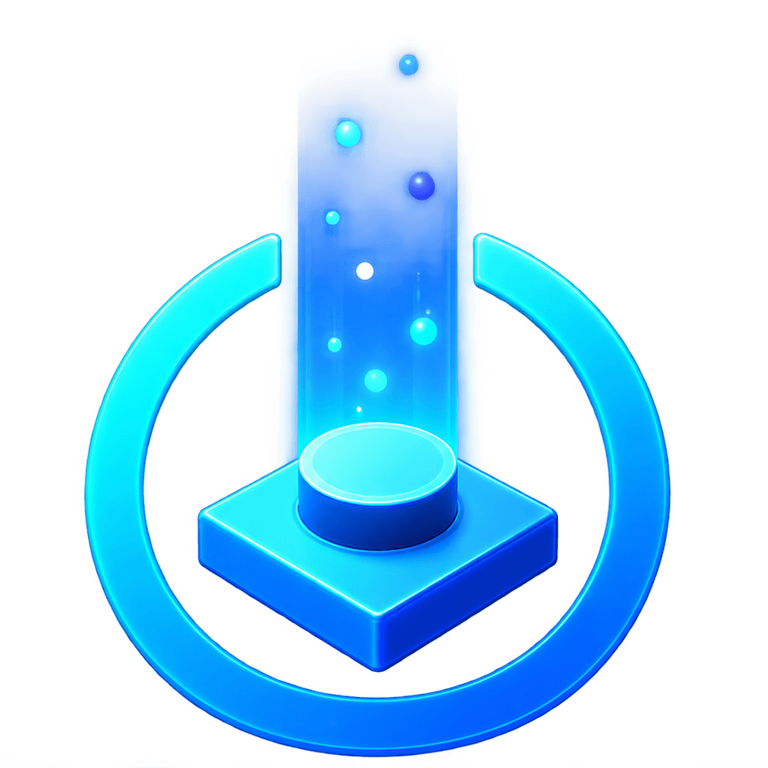

# LegoToypad

<p align="center">
  
</p>

A controller-driven companion app for LEGO Dimensions emulation. It emulates the Toypad and every tag - 78 characters and 240 vehicles across all 30 franchises - and sends them straight to the emulator. No mouse, no physical toy needed.

Works with any of the emulator builds below that have the local Toypad listener enabled. Everything (tags, art, sounds) is baked into `LegoToypad.exe` - there are no loose files to manage.

Thanks to the [LEGO Dimensions Discord](https://discord.gg/PuXpBMFE4P) for support!

## Custom toypad emulator builds

LegoToypad needs an emulator build with the Toypad listener enabled. Grab the one for your emulator:

| Emulator | Build |
|---|---|
| Cemu | [Cemu-2.6-Remote-Toypad-Build](https://github.com/harrysof/Cemu-2.6-Remote-Toypad-Build) |
| RPCS3 | [RPCS3-Seamless-Toypad-Build](https://github.com/NeverCookFirst/RPCS3-Seamless-Toypad-Build) |
| shadPS4 | [shadPS4-Seamless-Toypad-Bridge](https://github.com/NeverCookFirst/shadPS4-Seamless-Toypad-Bridge) |
| Xenia | [Xenia-Seamless-Toypad-Build](https://github.com/NeverCookFirst/Xenia-Seamless-Toypad-Build) |

## Features

- Full tag library built in: all 30 franchises, 78 characters, 240 vehicles
- Controller-first UI, no mouse needed
- True Toypad layout: 7 pad slots (3/1/3), with Load / Move / Clear per slot
- Custom tags: capture whatever the game writes to the Center pad and save it as your own
- Live Toypad LEDs mirrored from the emulator in real time (off by default)
- Swappable pad art (skins)
- Web remote: control the pads from your phone over LAN
- Xbox, PlayStation and Switch controllers supported, with matching button icons
- Fully configurable from an in-app Settings screen

## Using the app

1. Launch the exe - it sits in the tray until you toggle it (default: controller **Back**).
2. Pick a pad, then **Load** a franchise/character, **Move** it, or **Clear** it.
3. The **+** tile at the end of each roster captures a custom tag from the Center pad.

## Controls

| Input | Action |
|---|---|
| D-pad / stick | Move selection |
| A / Enter | Confirm |
| B / Escape | Back |
| Y / S | Settings |
| X / M | Pick up the focused pad's figure to move it |
| RB / L | Load a figure onto the focused pad |
| LB / C | Clear the focused pad |

Every binding except the D-pad can be rebound from Settings.

## Setup

1. Run `LegoToypad.exe`.
2. On first launch it creates a `LegoToypad.ini` next to itself. Make sure `[Listener] Port` matches your emulator build's Toypad listener port (default `9191`).

## Build (from source)

```powershell
cmake -S . -B build -A x64
cmake --build build --config Release
```
Output: `build\Release\LegoToypad.exe`

No Visual Studio? Use MinGW instead:

```powershell
cmake -S . -B build -G "MinGW Makefiles"
cmake --build build --config Release
```

## Notes

- Custom tags are stored as `CustomBins/<World>/<Name>.bin` next to the exe - back them up or copy them between machines freely.
- Toypad LED mirroring and custom tag capture both need one of the listener builds above; older listeners simply won't respond to those features.
- The exe is unsigned, so Windows SmartScreen will flag it on first launch. Click "More info" then "Run anyway."
